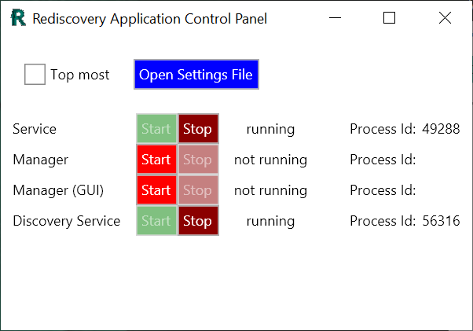
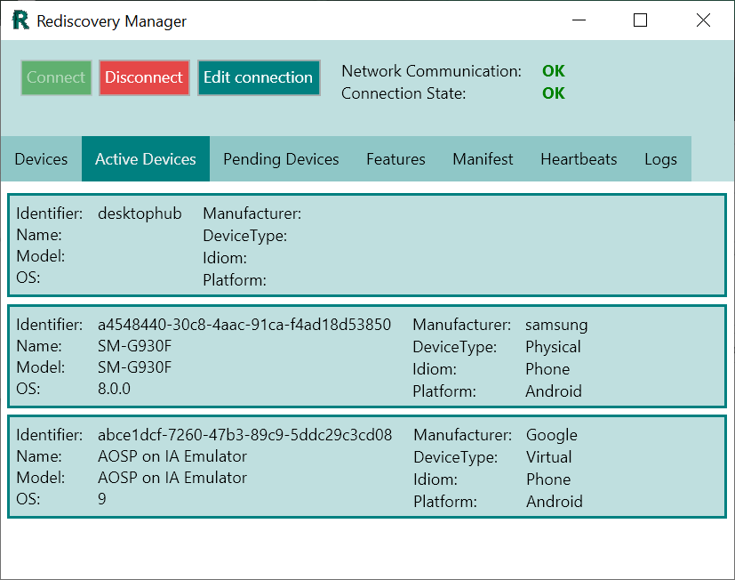
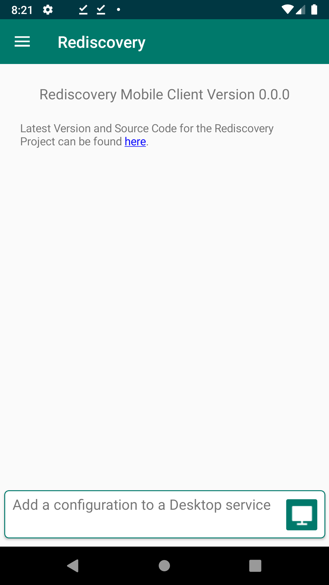
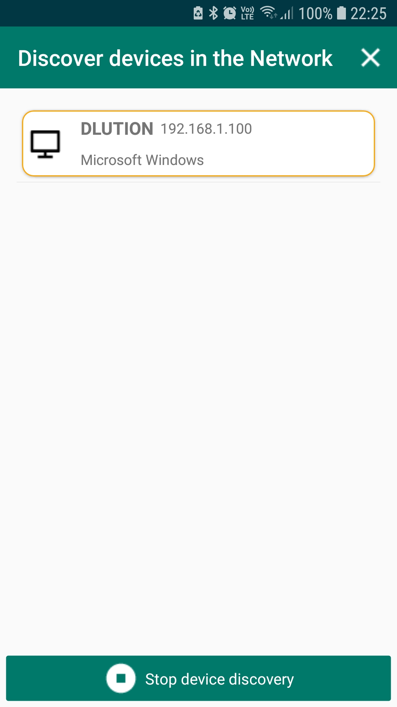
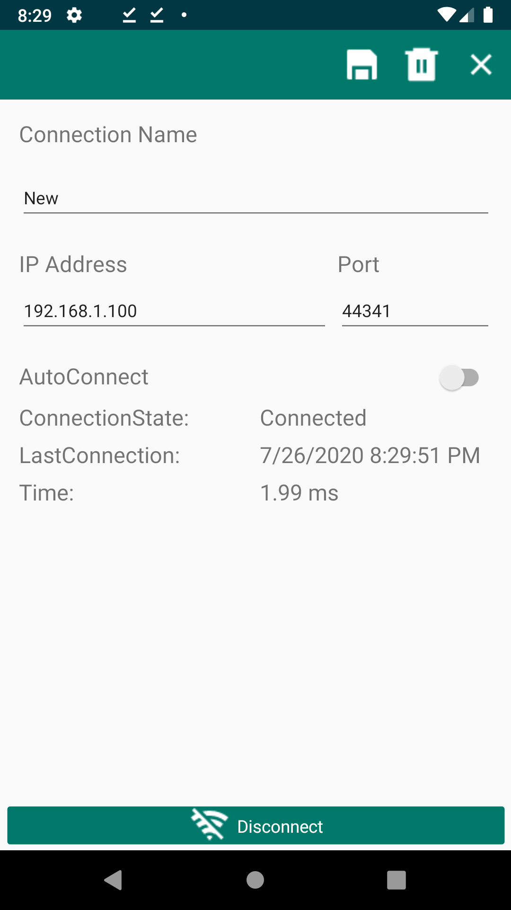
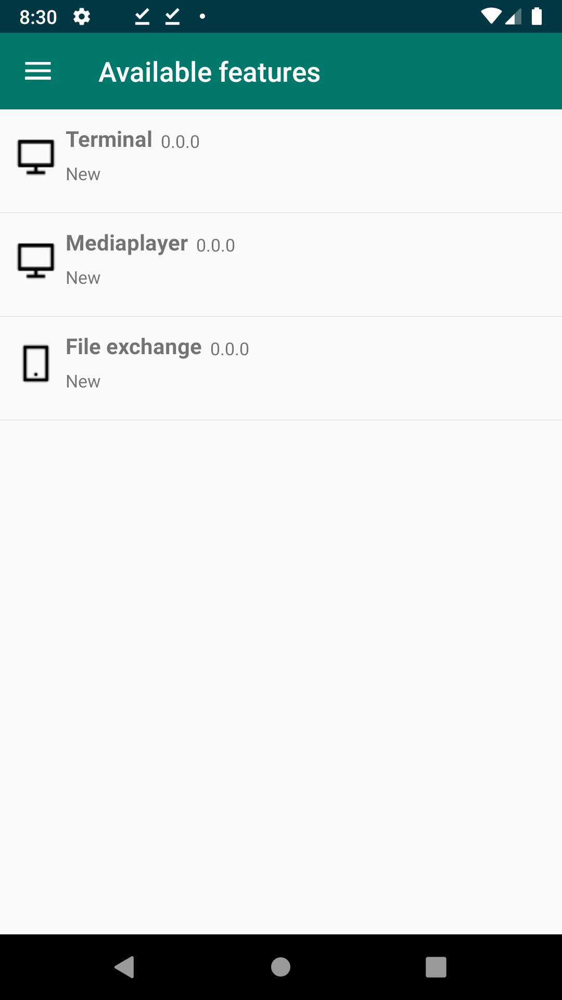
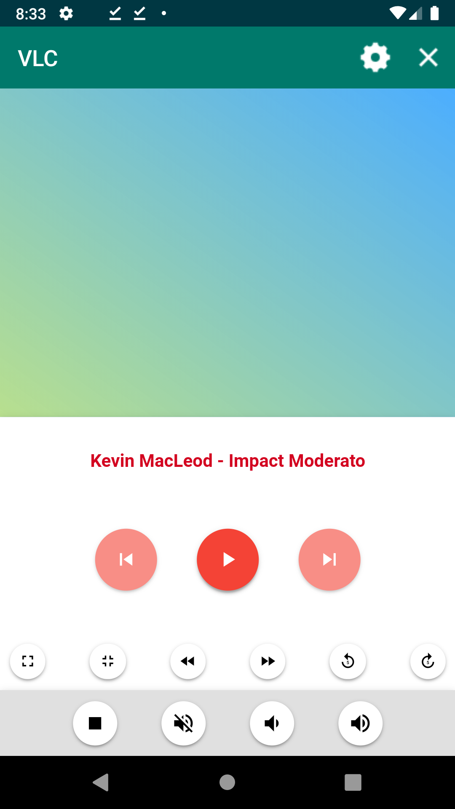
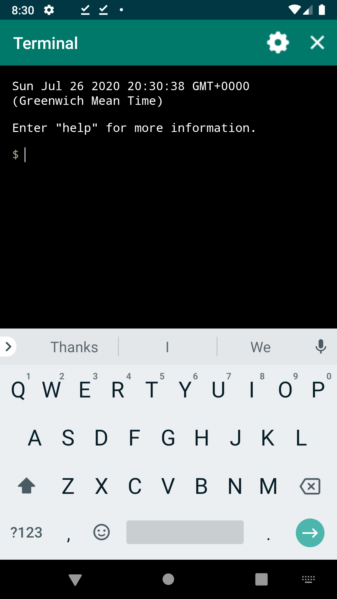
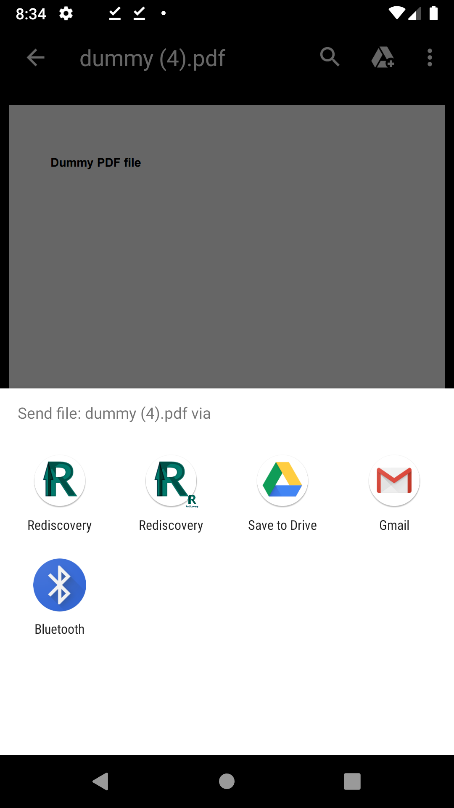

# Rediscovery

Rediscovery allows you to remote execute functions on desktops and Android phone from another device.

The available functions on the remote device and the control UI on Android are all plugin based.
With the plugin system everybody with a little coding knowledge should be able to create functions and a UI to easy remote execute any task.
Execute Android functions from a desktop is not integrated yet, but it will come.

### Goal

The Goal of Rediscovery is to create a Bi directional remote control Crossplatform software with the ability of ease to extend.

### Technology and Frameworks

* C#
* .NET Core
* Xamarin
* Avalonia
* Grpc
* JavaScript
* HTML
* Sqlite

## Desktop Applications

### Control Panel

The control panel is as the name says the central control of the desktop services and UI at the moment.

### Manager GUI

Manager GUI shows informations about devices connected to the service, logs and saved devices.

### Manager

The manager should have pretty much the same functions the Manager GUI but in the command line.

### Service

Main service to provide all features and is required run if you want to use any other desktop application.

### Discovery Service

This service allows you to use the discovery function on the Android application and remove the need to manual configuration the desktop on Android.

## Android

